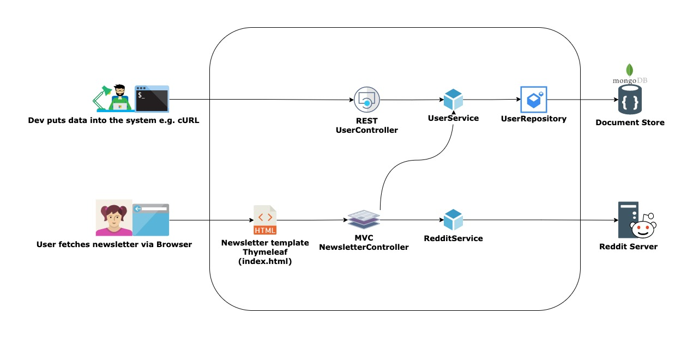

# Reddit Newsletter

## Overview

The system allows the creation of a newsletter for registered users, so they can see the top 3 posts of 
their favorite reddit channels.

I implemented that in Spring Boot, using MongoDB to store users and Thymeleaf to render the newsletter. 

A rough sketch of the architecture / use cases.


* A REST controller allows CRUD manipulation of Users.
* An MVC controller allows fetching the reddit posts based on the favorite channels of the user.


## How to build 

Building with `mvn clean install` will also run tests, which use TestContainers: please have docker running or use `-DskipTests`.

## How to start

1. Make sure MongoDB (version 4) is running (default settings will do fine) either via local installation or container.
    
   *  **Local installation:** download and run the installer. Then launch with `mongod --dbpath <path to an empty folder>` such as `~/Downloads/mongodb4/dbdata-reddit` (the folder must exist before the startup, so needs to be created with e.g. `mkdir`). 
   
   *  **Containers:** follow the [official instructions here](https://www.mongodb.com/compatibility/docker).


2. Preferably start the app providing a value for the property `reddit.app.id` either by passing it via arguments `-Dreddit.app.id={value}` or by placing the value in the property file. You can use the start functionality from the IDE or `mvn spring-boot:run` from the command line.

## How to use it

1. Insert one or more users with cURL, like this (can actually copy-paste and execute the following).
   ```
   curl -X POST -H "Content-Type: application/json" -d '{"name":"Homer", "email":"homer.simpson@mail.com", "favorites":["bowling"]}' http://localhost:8182/user
   ```
   Take note of the returned `userId` (something in a format similar to `6202722e7681d63229944915`), to be used to fetch the newsletter (next step).
   

2. To fetch a user's newsletter, point the browser to `http://localhost:8182/user/{userId}/newsletter` replacing the placeholder `{userId}` with the actual value.


3. To try the functionality, you can change the subreddits with 
    ```
   curl -X PUT -H "Content-Type: application/json" http://localhost:8182/user/6202722e7681d63229944915/favorites -d '{"channelsToDelete": ["bowling"], "channelsToAdd": ["flowers", "beer"]}'
   ```
   and refresh the browser to see the changes.
   
   **Implementation note:** I decided to pass a Dto with the 2 sets (`channelsToAdd` and `channelsToDelete`), so to avoid both duplicated code, and the need for repeated calls in case of richer updates.
   
   Moreover: 
   * the operation is idempotent because the underlying structures are sets.
   * there's no race conditions issues, because it's a single update on a single document (which is atomic in MongoDB).

## Misc

   Examples of how to also  `GET` and `DELETE` users:
   ```
   curl -X GET  http://localhost:8182/user/6202722e7681d63229944915
   
   curl -X DELETE http://localhost:8182/user/6202722e7681d63229944915
   ```
